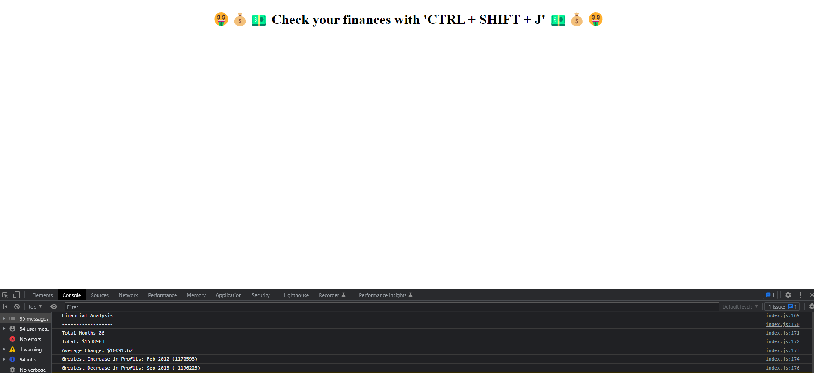

# **Introduction**
The purpose of this challenge is to be able to successfully negotiate an array and use js code to manipulate the data within the array. It is important to appreciate that the array is not a simple linear one but one which has 86 arrays within. Each of these arrays represents a month with financial profit/losses.

## Method
In order to address this exercise successfully some of the properties of arrays used in The bootcamp were needed. These included
1. array.length

2. iterating through an array using a for loop

3. using array notation effectively to determine the locations of greatest increase and decrease in profits

4. concatenating strings and variables in the console to display the final result. 

Some of the methods not used in the bootcamp and needed research were:

1. sorting an array using array.sort() Appreciation of how this works requires an understanding that array.sort() requires a callback function and specifically for the array used in this exercise the need to use array indexes to iterate through the array to obtain the desired function

2. a better understanding of using operators to obtain the desired result in calculations. In this exercise the subtractoin assignment (-=) needed to be employed.

### ***What I Learnt From This Exercise***

1. attaching the correct js file to the html document
2. creating a test.js file to try the methods as described above on a smaller array to improve my understanding of how such an array functions. I learnt that the array in question was a _nested array_ and accessing each element required the use of 3 indices: the row index, first column and second column indices.
3. I used MDN array search to learn about the different array methods and tried several in an attempt to sort the array. I went through a whole load of trial and error methods such as

    * array.map() to create a new array of objects - [month: string, value: profit]. I found this quite difficult to order and realised this was probably not the simplest way to sort an array

    * array.reduce() to obtain a single finger for greatest increase - but again quite a hard concept to use in this exercise and the desired result not achieved

    * functions such as foreach() which allowed me to modify the array to [month: string, value: profit] but then it was difficult to re-order it to obtain greatest increase and decrease in profits from the finances nested array provdied for this exercise.

    * array.sort() - my biggest difficulty in understanding this was the callback function part of this method. I looked at two notations: finances.sort(function (a, b) {
    return a[1] - b[1]; and then the arrow function as suggested by vs code: finances.sort((a, b) => a[1] - b[1]);

    I settled for the arrow notation as it seemed simpler to understand and easy to write.

4. Using Math.max and Math.min was not successful in obtaining the maximum and minimum numbers from the array as all it did was find the max/min numbers for each array and print them out in the console. 

5. Simplyfying lines of code by assigning variables to important parts of code that would be used repetitively.

### Understanding the index.js file
In this file I have commented out my thinking and also some of the console.logs() I used to ensure the code was working. In addition I have added an header text to the HTML using js syntax including emojis with the process of "windows + ."

### Additions to the repo and exercise
I have added in the test.js file to indicate how I used a simpler nested array like the finances one to understand better how to manipulate it, access items/elements. The use of array.sort() example was taken from MDN so I could see in realtime how this example worked. It enabled me to used array.sort() better and also ensure by assigning a new array name that the original array would not be permanently modified.

### Mock-up Image

